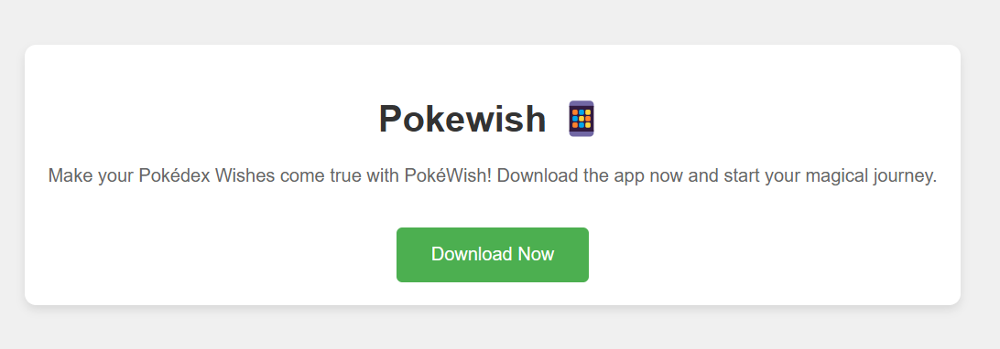

# PokéWish

### Idea
<details>
PokéWish is a simple expo app that allows you to look at the Pokédex via the PokéAPI. There are also some additional features native to phones like vibrations and shaking. 
</details>

### Motivation

<details>
I used to play a lot of Pokémon and watch the series. In the series, I was always fascinated by the Pokédex, which is like an encyclopedia. You can scan a Pokémon with it and then get information about that Pokémon.
</details>

## Running
### Installation

<details>

To install the app, you need to have the expo-cli installed. You can install it via npm:

```bash
npm install -g expo-cli
```

After that, you can clone the repository and install the dependencies:

```bash
git clone https://github.com/DaniDevOfficial/PokeWish.git

cd PokéWish

npm install
```
</details>

### Usage

<details>
To start the app, you can use the following command:

```bash
expo start
```
Scan the QR Code with the Expo go app or look at the app in the browser.

</details>

## Story Board

<details>

### On the First Screen
The app is simply opened and a GET request is sent to the Pokémon API to fetch the data and display it.

### When the User Presses the Next Button
The phone briefly vibrates to inform the user that the press was successful and a new Pokémon is loaded.  
Here, the user presses the Next button.  

### Screen 2
The Pokémon data is nicely displayed again for viewing. Now, the user shakes the phone and by doing this, a new Pokémon is loaded.  
Here, the user shakes the phone.

### User Interactions
The user now knows all interactions/interfaces of the app and can use it exactly as they want.


</details>


## Technical Mockup

<details>

##### Start Vibration
Actor: User  
Description: The user presses the Next button to make the device vibrate and load a new Pokémon.  
Preconditions: The app is open and functional.  
Postconditions: The device vibrates for a specified duration.  

##### Detect Shake Event
Actor: User  
Description: The user shakes the device, and the app detects this and loads a new Pokémon.  
Preconditions: The app is open and functional.  
Postconditions: A message is displayed on the screen.  

##### Fetch and Display Pokémon Data
Actor: User
Description: When the app starts, Pokémon data is fetched from an external API and displayed on the screen.  
Preconditions: The app is open and functional. An internet connection is available.  
Postconditions: Pokémon data (e.g., name, image) is displayed.  

#### Non-Functional Requirements
Reliability: The app has an uptime of 99.9%. Maximum crash rate of 1 crash per 1000 sessions.  
Performance: The app loads data from the Pokémon API within 2 seconds. Vibration and shake events respond within 200ms.  
Usability: The app provides an intuitive user interface with clear buttons and instructions.  
Compatibility: The app is compatible with Android 10 and above, as well as iOS 13 and above.  

#### Test Concept

##### What devices will be used to test the app?
Devices: Physical Android and iOS devices  

##### How will the app be tested?
Test Methods:  
- Blackbox Tests: Functional tests without knowledge of the internal code  
- Whitebox Tests: Unit tests using Jest  
- Manual Tests: Tests on smartphones  

##### Test Cases
Vibration Tests:  
- Test Case 1: Device vibrates when the button is clicked  
- Test Case 2: Vibration lasts for the specified duration  

Shake Tests:  
- Test Case 1: New Pokémon is loaded upon shaking  

API Integration Tests:  
- Test Case 1: Pokémon data is successfully fetched and displayed  
- Test Case 2: Error message is displayed when the API is unreachable
</details>


## Features

### Planed
<details>


### Pokémon API 
The app uses the PokéAPI to get the data for the Pokédex. You can look at the Pokémon and their stats. 

### Vibration
The app is able to vibrate the phone. You can trigger the vibration by pressing the next in the app. This is so you can feel a response when you press the button.

### Shake
The app can also detect when you shake the phone. This is used to trigger the next pokemon.

### Sound 

When the Sprite of the Pokémon is pressed, the latest recorded cry of that Pokémon will be played. 

</details>


### Actualy implemented

<details>

- Sound  
- Pokémon API
- Vibration
- Shake
- App Icon
- Multi Page Routing


</details>


## Design

### Planed
<details>
 I planed to create a simple App where the stats of the Pokémon are displayed with a image and a next button.


</details>

### Actualy implemented

<details>

I changed the design a bit so it looks better, but held the concept the same. 


</details>

## Other

### Component Diagram

<details>

This displays the connection between the components that i used and also shows of the PokéAPI.


</details>

### Planing

<details>

#### UseCases
The usecases show how the user interacts with the App and how the app is connected to the API.


#### UML Diagram

This shows how the Client interacts with the App but way more detailed. 


</details>

### Website

<details>

Instead of Creating a PlayStore app and spend money I just created a simple website to display a download button. 




</details>


## Reflection

<details>

At first I didnt realy have any idea on what kind of App to create, but after some thinking I came up with the idea of PokéWish. After that I thought a lot about on how to improve the App with caching, logging and searching, with which I could improve the App in a second week. 

In conclution it helped me to learn about Expo and use my skils from the web to create a mobile application. 

</details>


## Contributing

- only me no need to contribute 😱😱😱😱


## Sources


<a href="https://www.flaticon.com/de/kostenlose-icons/pokemon" title="pokémon Icons">Pokémon Icons erstellt von Freepik - Flaticon</a>